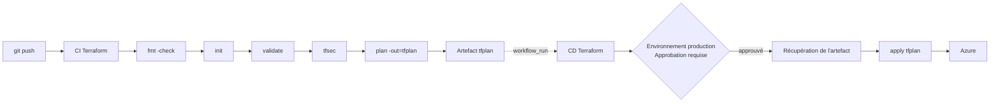

# TravelBuddy — Infrastructure as Code

[](https://github.com/hamiche-sirine/travelbuddy-infra/actions/workflows/ci.yml)

Infrastructure Azure de l'application **TravelBuddy**, décrite en Terraform et déployée par une
chaîne CI/CD GitHub Actions avec approbation manuelle.

> Module DevOps CI/CD & IaC — ESGI 4A IABD — Groupe 7

---

## Périmètre du projet

TravelBuddy est une **application web à trois composants** : une API FastAPI, une interface
Next.js et une base PostgreSQL. Ce dépôt ne contient pas le code applicatif — il contient la
description de l'infrastructure qui l'héberge et la chaîne qui déploie cette infrastructure.

L'objet du projet est donc **l'industrialisation du déploiement** : passer d'un environnement
créé à la main dans le portail Azure à un environnement décrit dans du code versionné, planifié,
relu et appliqué par un pipeline.

Le déploiement d'une application web impose des contraintes qu'un traitement par lots n'a pas :
exposition publique en HTTPS, configuration inter-services (le frontend doit connaître l'URL du
backend, le backend doit accepter l'origine du frontend), et gestion de révisions.

---

## Architecture déployée

Onze ressources dans le groupe `rg-travelbuddy-dev`, région `swedencentral`.

| Rôle | Type Terraform | Nom |
|---|---|---|
| Groupe de ressources | `azurerm_resource_group` | `rg-travelbuddy-dev` |
| Registre d'images | `azurerm_container_registry` | `acrtravelbuddydev` |
| Journalisation | `azurerm_log_analytics_workspace` | `log-travelbuddy-dev` |
| Environnement d'exécution | `azurerm_container_app_environment` | `cae-travelbuddy-dev` |
| API (port 8000) | `azurerm_container_app` | `ca-backend-travelbuddy-dev` |
| Interface (port 3000) | `azurerm_container_app` | `ca-frontend-travelbuddy-dev` |
| Serveur de base | `azurerm_postgresql_flexible_server` | `psql-travelbuddy-dev` |
| Base de données | `azurerm_postgresql_flexible_server_database` | `travelbuddy` |
| Règle de pare-feu | `..._firewall_rule` | `AllowAzureServices` |
| Coffre à secrets | `azurerm_key_vault` | `kv-travelbuddy-*` |
| Mot de passe administrateur | `azurerm_key_vault_secret` | `postgres-admin-password` |

S'y ajoutent deux générateurs (`random_password`, `random_string`) et sept blocs `data` en
lecture seule.

### Deux points d'architecture

**Le domaine public n'est jamais codé en dur.** Azure attribue à l'environnement Container Apps
un domaine aléatoire, qui change à chaque recréation. Les deux applications le référencent via
`azurerm_container_app_environment.main.default_domain`, ce qui permet au backend et au frontend
de se découvrir mutuellement sans intervention manuelle après un `apply`.

**Le mot de passe de la base n'existe nulle part en clair.** Il est généré par `random_password`,
déposé dans Key Vault, et injecté dans le backend sous forme de secret de conteneur.

---

## Chaîne CI/CD



### Intégration continue — `.github/workflows/ci.yml`

Déclenchée à chaque `push`. Quatre contrôles avant la planification :

| Étape | Rôle |
|---|---|
| `terraform fmt -check` | La forme du code — échoue si le formatage n'est pas canonique |
| `terraform init` | Connexion au backend d'état distant |
| `terraform validate` | Le sens du code — cohérence des types et des références |
| `tfsec` | Analyse statique de sécurité (non bloquante, voir plus bas) |
| `terraform plan -out=tfplan` | Calcul du plan, **sérialisé dans un artefact** |

### Déploiement continu — `.github/workflows/cd.yml`

Déclenché par `workflow_run` sur succès de la CI. Le job cible l'environnement GitHub
`production`, protégé par un relecteur obligatoire : **il démarre, puis se met en pause avant
toute étape**, jusqu'à approbation humaine.

Il n'y a **aucun `terraform plan` dans la CD**. Le pipeline récupère l'artefact produit par la CI
et l'applique tel quel : `terraform apply -auto-approve -input=false tfplan`.

C'est le point central de la conception : le plan relu par l'approbateur est, au bit près, le plan
appliqué sur Azure. Replanifier au moment de l'application rouvrirait la fenêtre entre la
décision et l'exécution.

Chaque approbation laisse une trace horodatée dans la section *Deployment protection rules* du
run — qui a approuvé, quand, pour quel environnement, avec quel commentaire.

---

## L'état Terraform

Le fichier d'état relie les blocs du code aux identifiants réels des ressources Azure. Il occupe
une place à part dans le dispositif, et sa gestion suit une chaîne de conséquences :

- L'état ne peut pas se gérer lui-même, **donc** son stockage est amorcé à la main, hors Terraform.
- Il contient des valeurs sensibles en clair, **donc** il ne rejoint jamais le dépôt Git.
- Il est partagé entre quatre personnes et un pipeline, **donc** il réside dans un stockage central
  qui gère le verrouillage.

### Backend distant

```hcl
resource_group_name  = "rg-tfstate"      # groupe distinct, hors du périmètre applicatif
storage_account_name = "sttfstate*"
container_name       = "tfstate"
key                  = "travelbuddy.terraform.tfstate"
use_azuread_auth     = true              # authentification par identité, pas par clé de compte
```

Protections activées : TLS 1.2 minimum, accès anonyme désactivé, versioning de blob, corbeille
sept jours.

Le groupe `rg-tfstate` est **volontairement séparé** du groupe applicatif. Une suppression
accidentelle du second laisse le premier intact — l'infrastructure se reconstruit alors en une
commande.

### Verrouillage

Pendant un `apply`, l'agent GitHub détient un verrou sur l'état. Toute commande Terraform
concurrente est refusée, le message identifiant le détenteur du verrou.

> **Convention d'équipe :** une seule personne lance `terraform apply` à la fois.

---

## Gestion des secrets

| Secret | Origine | Chemin jusqu'au conteneur |
|---|---|---|
| `postgres-admin-password` | Généré par `random_password` | Key Vault → secret de conteneur |
| `openai-api-key` | Déposé manuellement | Key Vault → bloc `data` → secret de conteneur |
| `geoapify-api-key` | Déposé manuellement | idem |
| `serpapi-api-key` | Déposé manuellement | idem |
| `mistral-api-key` | Déposé manuellement | idem |
| `jwt-secret-key` | Déposé manuellement | idem |
| `restcountries-api-key` | Déposé manuellement | idem |

Les clés d'API sont déposées **hors Terraform** (`az keyvault secret set`) et lues par des blocs
`data`. Aucune valeur sensible n'apparaît dans le dépôt.

**Limite assumée :** une valeur lue par un bloc `data` finit en clair dans le fichier d'état.
C'est précisément pourquoi les deux protections sont nécessaires — Key Vault pour l'origine, et
un état chiffré, privé et hors dépôt pour la destination.

### Identité du pipeline

Le pipeline n'a pas d'identité humaine, donc un service principal dédié, `sp-travelbuddy-github`,
avec trois rôles :

| Rôle | Portée | Raison |
|---|---|---|
| `Contributor` | Abonnement | Créer et modifier les ressources |
| `Storage Blob Data Contributor` | Compte de stockage de l'état | Lire et écrire le fichier d'état |
| `Key Vault Secrets Officer` | Key Vault | Lire les secrets référencés par les blocs `data` |

Les trois sont nécessaires : être propriétaire d'une ressource relève du **plan de contrôle** et
ne donne aucun accès aux **données** qu'elle contient — ni aux blobs, ni aux secrets.

Les identifiants du service principal sont stockés dans le secret GitHub `AZURE_CREDENTIALS`.

---

## Prérequis

| Outil | Version de référence |
|---|---|
| Terraform | 1.15.8 |
| Provider `azurerm` | 4.81.0 (`~> 4.0`) |
| Provider `random` | 3.9.0 (`~> 3.6`) |
| Azure CLI | 2.88.0 |
| Docker | 29.2.1 |

Six fournisseurs de ressources ARM doivent être enregistrés sur l'abonnement : `Microsoft.Storage`,
`Microsoft.ContainerRegistry`, `Microsoft.App`, `Microsoft.OperationalInsights`,
`Microsoft.DBforPostgreSQL`, `Microsoft.KeyVault`.

---

## Utilisation

### Cycle local

```bash
terraform fmt        # avant chaque commit, sinon la CI échoue sur fmt -check
terraform init
terraform validate
terraform plan       # lecture seule
```

Le `plan` local sert à vérifier son intention avant de pousser. **L'application passe par le
pipeline** : c'est lui qui détient l'identité autorisée et qui produit la trace d'approbation.

### Publier une nouvelle image applicative

Les images sont construites localement puis poussées vers l'ACR — les *ACR Tasks*
(`az acr build`) ne sont pas disponibles sur un abonnement Azure for Students.

```bash
az acr login --name acrtravelbuddydev
docker build -t acrtravelbuddydev.azurecr.io/travelbuddy-backend:vN -f backend/Dockerfile ./backend
docker push acrtravelbuddydev.azurecr.io/travelbuddy-backend:vN
```

Le frontend reçoit l'URL du backend **au moment du build**, Next.js figeant les variables
`NEXT_PUBLIC_*` dans le bundle :

```bash
docker build -t acrtravelbuddydev.azurecr.io/travelbuddy-frontend:vN \
  --build-arg NEXT_PUBLIC_API_URL=<url-backend> -f frontend/Dockerfile ./frontend
```

Le déploiement se fait ensuite en mettant à jour `backend_image` ou `frontend_image` dans
`variables.tf`, puis en poussant — la chaîne CI/CD prend le relais.

---

## Structure du dépôt

```
travelbuddy-infra/
├── .github/workflows/
│   ├── ci.yml              fmt, init, validate, tfsec, plan -out, publication de l'artefact
│   └── cd.yml              workflow_run, environnement production, apply de l'artefact
├── providers.tf            providers azurerm et random, backend azurerm
├── variables.tf            6 variables d'entrée
├── main.tf                 groupe de ressources et tags
├── registry.tf             registre de conteneurs
├── container-apps.tf       Log Analytics, environnement, 2 applications, blocs data Key Vault
├── database.tf             mot de passe généré, serveur, base, pare-feu
├── key-vault.tf            coffre en mode RBAC
├── outputs.tf              acr_login_server, backend_url, frontend_url
└── .gitignore              *.tfstate, .terraform/, *.tfplan, *.tfvars
```

---

## Décisions techniques assumées

**`tfsec` en mode non bloquant.** L'outil signale la règle de pare-feu PostgreSQL ouverte aux
services Azure. L'alerte est pertinente mais la contrainte est structurelle : les agents GitHub
n'ont pas d'adresse IP stable. Le choix est donc documenté plutôt que masqué — l'analyse tourne,
son résultat est visible, et son arbitrage est explicite.

**Régions restreintes par politique.** Une politique d'abonnement limite les déploiements à
`uaenorth`, `spaincentral`, `polandcentral`, `swedencentral` et `norwayeast`. Un groupe de
ressources échappe à cette politique — c'est un objet logique — mais les ressources qu'il contient
non. D'où `swedencentral`.

**Profils de charge Container Apps déclarés explicitement.** Azure crée d'office un profil
`Consumption` sur tout environnement Container Apps, et chaque application en hérite le nom. Tant
que la configuration ne les déclarait pas, Terraform annonçait trois modifications à chaque
exécution et envoyait des requêtes de mise à jour vides. Déclarer ce que la plateforme impose
restaure l'idempotence du plan.

**`0.0.0.0` → `0.0.0.0` sur le pare-feu PostgreSQL.** Ce n'est pas une plage d'adresses : c'est la
convention Azure signifiant « autoriser les services Azure internes ». Le serveur n'est pas exposé
à Internet.

---

## Équipe

Groupe 7 — Sirine HAMICHE · Khaoula CHETIOUI · Thinhinane AKRICHE · Aymen BOULAHIA
